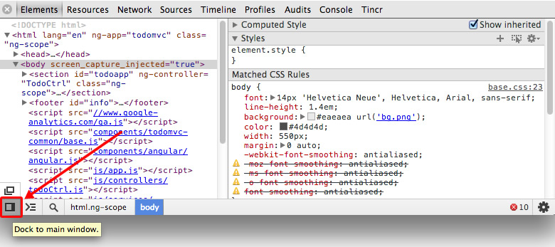
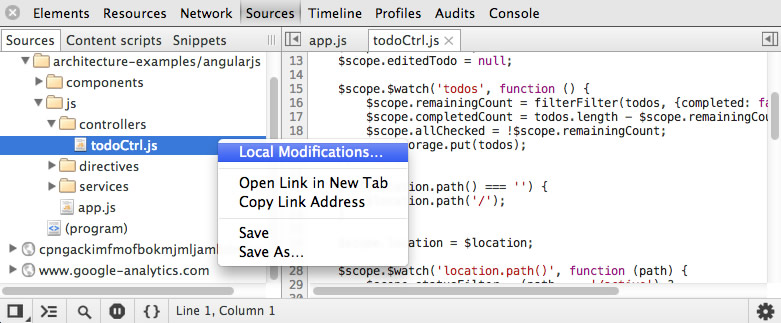
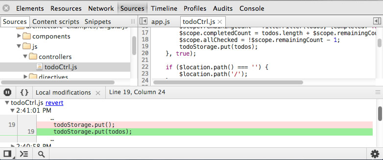
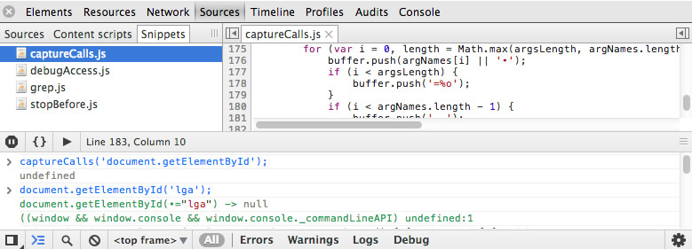
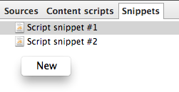
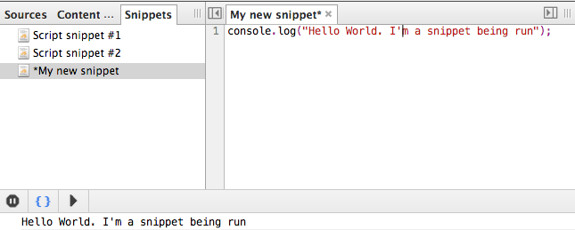

## [Authoring & development workflow](https://developer.chrome.com/devtools/docs/authoring-development-workflow)

> 开发者的工作流典型地涉及许多步骤去达到目标。当我们在编程过程中使用**DevTools**，就可以去完善我们的工作流以便来达到节约完成日常任务的时间，比如定位文件或者是函数，持续编辑脚本或者样式，保存常用代码块或者简单重新整理让你满意的布局。
在这个章节，我们将会挖掘一些技巧来让你的工作流更高效

### Dock-To-Right For Vertical-Split Editing

你可能会发现把**DevTools**放置到窗口的底部会出现很大一块水平的空间，但是垂直空间相应变少了。把**DevTools**放到窗口的右边让你可以去跟窗口的右手边对齐并且同时让它附属上。这样做让你可以在窗口的左边审查当前页面并在同时在右边调试。

这样子做好处是：
* 你可能有宽屏显示器，希望最大化利用空间去审查和调试代码；
* 你可以改变分隔的窗口，让它的宽度小于400px(当前Chrome的最小宽度)去测试调整窗口后页面布局的变化；
* 脚本长的时候尽量多利用垂直空间比较容易调试。

访问某个URL，你希望调试的话，可以在**DevTools**左下角点击并且**长按住**布局图标来切换`Devtools`是放在窗口的右边还是窗口的底部。



> 切记：`Devtools`会记住你最后一次选择的。因此你可以在这两种常用的选项中来回切换

一旦你选中某个预设，布局也会随着立即改变。


> 注意：每一个标签都有自己自定义的布局设置。这就意味着可能有些标签是放在窗口右边的而有些是放在窗口底部的

### Search, Navigate And Filter

##### 1. Filter For A Script, Stylesheet Or Snippet By Filename
能够快速定位到特定文件的能力是一个开发者工作流中必备的一项。***Devtools**可以让你通过用下面的快捷键来搜索所有有关脚本，样式和一些代码片段的文件：

* **Ctrl+O**(window, linux)
* **Cmd+O**(Mac OS X)

不管你现在在哪个面板都可以使用。对于这个[Todo app](http://todomvc.com/examples/angularjs/)网站，随便用上面快捷键的任意一个都会引导我们到**Sources**面板，并且还会出现一个列出所有可以查找的文件的搜索框。


这样子我们就可以找到我们想要的文件了或者选中某个文件去查看和编辑。


> 注意：在所有的对话框我们支持驼峰型匹配，比如你想要打开`FooBarScript.js`，那你可以输入`FBaSc`就行了，这样子比较节约时间。

##### 2. Text Search Within The Current File
在当前文件中找到特定字符串，可以用下列的快捷键
* **Ctrl + F** (Windows, Linux)
* **Cmd + F** (Mac OS X)

一旦在搜索框中输入关键字，敲击`enter`键后光标会移动到第一个匹配的结果。后面匹配的内容可以通过`up`和`down`来进行选择。


##### 3. Replace Text Within The Current File
除了提供在当前文件中查找之外，**Devtools**还支持单个、多个替换。选中`Replace`后会出现输入框，而第二个输入框是可以让你填写替代文本的。


##### 4. Text Search Across All Files
如果你想要在全部已经加载完成的文件中查找某个特殊字符串的话，你可以用下列的快捷键来打开对应的搜索框
* `Ctrl + Shift + F` (Windows, Linux)
* `Cmd + Opt + F` (Max OS X)
也是支持正则表达式和大小写敏感搜索


##### 5. Search Using A Regular Expression
用正则表达式搜索，可以先简单地输入表达式到搜索框，然后选中`Regular expression`并回车


上面我们可以看到一个有关如何做到找出所有div标签里的内容的例子

##### 6. Filter For A Function Or Selector Within A File
你需要更精细的搜索，`Devtools`也可以让你在一个文件中找到特定的JavaScript函数或者CSS规则。

选中`Source`面板。你可以用下列的快捷键来唤起`特定函数/选择器`搜索框。
* `Ctrl + Shift + O` (Windows, Linux)
* `Cmd + Shift + O` (Mac OS X)
`(译者注：好像不能用啊)`


根据选中的文本类型你可以看到不是所有的JavaScript函数就是CSS声明。可以输入函数的名字或者声明来过滤掉一些不想要的函数或者声明，或者可以选中某个搜索结果，点击之后可以定位到当前文件对应的位置。

##### 7. Jump To Line Number
还支持跳到特定的行数。我们可以选中某个文件然后用下列的一些快捷键去触发行数对话框的显示

* `Ctrl + L` (Windows) `(译者注：好像改成了 Ctrl + G)`
* `Cmd + L` (Mac OS X)
* `Ctrl + G` (Linux)


###Live Editing Scripts & Styles

`Devtools`可以不需要重新刷新页面来实时修改脚本和样式，这样子对我们在调整页面设计和调试`JavaScript原型函数或者代码段`有所帮助。

##### 1. Scripts
可以通过 `Sources`面板自己修改JavaScript代码。
可以选用下面的容易操作来打开某个特定的脚本

(1). 直接在`Elements`面板HTML结构标签中点击脚本的链接(比如：`<script src="app.js"></script>`)


(2). 或者可以在`Sources`的子面板中任意选中脚本


这样子会在`Source`面板的右侧新建标签并显示脚本的源代码。

修改的代码只能在`evaluation time`执行，这就意味着在页面加载完成后还没跑的代码修改是没起效果的。修改一些异步的代码，比如`mouseover`的监听事件或者点击事件的回调函数，这些都无论如何都可以被修改成功和测试的。

想要了解有关在`Sources`面板中调试`JavaScript`的更多信息，可以参考我们的相关文档[JavaScript Debugging](https://developer.chrome.com/devtools/docs/javascript-debugging.html)。也可以去看[short screencast showing LiveEdit and breakpoint debugging](https://www.youtube.com/watch?v=WQZio5DlSXM)

> 注意：`Workspaces`特性让你可以持续地编辑你的本地文件 [Read more](https://developer.chrome.com/devtools/docs/workspaces.html)

##### 2. Styles
对于编辑样式也是同样的操作步骤的。打开`Devtools`，然后切换到`Elements`面板。在面板的右侧可以看到一些子面板包括到`Styles`。在一个页面中审查某个元素后可以在`Styles`子面板中看到一系列的有关当前节点的属性，是由各种选择器组成的。


`element.style`部分是可以看到页面相关节点的`style`属性。

下一个部分是`Matched CSS Rules`，是用来显示当前选中的元素的选择器，他的属性和值还有这CSS规则在哪一行和哪个文件。当前选中的节点的选择器是黑色的，而其他的不相干的会显示灰色。这样子做可以让选择器更容易去分辨。

修改任意一个CSS属性，比如元素的边框或者尺寸，都会立即在当前的页面显示出来。


回到`Matched CSS Rules`面板，点击紧挨着CSS规则的链接会转到`Sources`面板。在面板可以看到完整的样式表并且会移到对应CSS规则的行数。


从这里，你可以像用文本编辑器那样子去编辑文件，除了显示实时的修改

###Save As

一旦你对你修改的文件感到满意的话，你可以保存。

为了可以保存，首先你要确认被你修改的文件是在文本编辑器中能看到的，我们可以通过在`Sources`面板的左侧找到文件或者在`Element -> Style`面板点击文件名来让文件显示到`Sources`面板的文本编辑器中。

接下来选中文件名或者在文本编辑器中右键然后点击`Save As`。这样子可以覆盖掉你之前的文件。


`Subsequent saves`(可以用同样的菜单或者是`Ctrl/Cmd + S`快捷键)可以保存到同一路径。


###Local Modifications
`DevTools`维护着一个有关所有对本地文件修改的版本历史。如果你用`DevTools`编辑某个脚本或者样式并且保存修改，你可以在`Sources`面板中的对应文件的文件名右键并且选中`Local Modifications`去查看历史。


`Local Modifications`面板会显示下列信息：
* 修改点的不同
* 修改的时间
* 被修改文件的域


还有很多相关链接。*revert*链接可以帮你将文件恢复到原始状态并删除版本历史。

`Apply original content`都会做相同的操作，但是也会维护一个版本历史以便你可以让你恢复到某个修改



最后，`apply revision content`会回溯到某个时间点的版本(Finally, apply revision content will apply the changes for a specific revision at a set time.)

###Custom JavaScript Snippets

有时候你可能会想能够保存一些**脚本**，__书签__和**工具**，可以当你在浏览器调试的时候总能用到。`Snippets`是`DevTools`的新特性，能达到上述的效果，它允许在*Source*面板创建，保存和运行JavaScript。



一些有用的代码块可以帮助我们：

* __Bookmarklets__ 所有你的标签能够被存储为代码片段，特别是那些你想要去编辑的。
* __Utilities__ 跟当前页面交互的辅助工具可以被存储和调试。一些有效的[相关工具](https://github.com/paulirish/devtools-addons/wiki/Snippets)
* **Debugging** `Snippets`提供了语法高亮和持久化的多行控制台，比较方便去调试
* **Monkey-patching code** `Snippets`可以动态修改你想要修改的代码。

Brian Grinstead 在 [bgrins.github.io/devtools-snippets](http://bgrins.github.io/devtools-snippets/)上面维护了一个项目是有关有用的代码片段。

##### Getting Started
来，我们开始来玩下 `Snippets` ，可以先切换到`Sources`面板。如果你没在这个标签中操作的话，那就会出现如下图的默认布局


然后点击左上角的切换按钮来显示扩展的面板。这样你就可以看见到*Sources*, *Content scripts* 和 *Snippets*。然后点击*Snippets*


##### Creating Snippets
*Snippets*有两个面板，左边是文件列表，当你选中某个代码片段它会在有右边的面板中打开。这个就有点跟在`Source`面板中选中某个脚本或者样式相似的操作。


可以在文件列表右键然后选中`New`来创建新的代码片段




##### Snippet Filenames
文件名是自动生成的，但是你可以修改。


如果你想重命名文件的话，可以在做左边面板的文件列表中右键然后选中`Rename`。你也可以移除你的代码片段。


##### Editing And Executing Snippets
选中一个代码片段文件就可以在右边面板中编辑。你可以编写和粘贴任何JavaScript代码包括函数和表达式。


如果某个文件名前面有`*`号的话，这就意味它被修改了但是还没被保存。

你可以右键文件名然后选中`Run`来运行代码片段，或者点击 __Run(>)__按钮。


如果代码需要有一些控制台输出的话，那么它会显示到编辑器下方的控制台

```
注意：可以用 Ctrl/Cmd + Enter 快捷键来执行代码块
```



如果你想在控制台中执行某些特定行的代码片段的话，你可以在编辑器中选中你要运行的代码片段，然后在你选中的代码右键并选择`Evaluate in Console`选项去运行。也可以用快捷键 `Ctrl + Shift + E`


`Run`按钮也一样，输出的表达式可以在编辑器下方的控制台看到。


##### Local Modifications

跟 _Sources_ 一样， _Snippets_ 也是支持可以查看当地修改并且可以恢复到某个特定的版本。

要用到这个功能，可以在你保存修改后，在编辑器窗口右键然后选中`Local Modifications`


##### Breakpoints, Watch Expressions And More

还有其他特性你是可以在_Sources_面板用到的，比如添加`监视表达式`，`断点`，`作用域变量`和`保存文件`，这些同样可以在_Snippets_中用到。

可以查看_Sources_相关的文档，了解有关如何用这些特性的更多信息。


##### Saving Snippets

为了显示`Snippet`的保存选项，在文本编辑器右键就可以显示编辑器菜单。


_Save_将会保留你当前的代码块文本的修改。而_Save As_可以保存你的代码块到另外一个新文件。

```
注意：Snippets 会被存储在 DevTools 的 localStorage中。当你操作 Save/Save As, 你可以像任何其他脚本一样保存你的代码块。
```

##### Navigating Snippets

跟_Sources_相似，`Snippets`也支持使用相同的快捷键来导航到某个特定的代码块文件，函数或者是行数。


###Resources
* [Chrome DevTools Revolutions 2013: Workspaces](http://www.html5rocks.com/en/tutorials/developertools/revolutions2013/#toc-workspaces)
* [My workflow: Never having to leave the DevTools | remy sharp](http://remysharp.com/2012/12/21/my-workflow-never-having-to-leave-devtools/)
* [The Breakpoint With Addy Osmani And Paul Lewis - Snippets | youtube](http://www.youtube.com/watch?feature=player_detailpage&v=ktwJ-EDiZoU#t=553s)
* [Chrome Dev Tools: JavaScript and Performance | nettuts](http://net.tutsplus.com/tutorials/tools-and-tips/chrome-dev-tools-javascript-and-performance/)
* [Iterating with the Chrome DevTools | jeremey kahn](http://www.youtube.com/watch?v=Phw6edMppKg)


