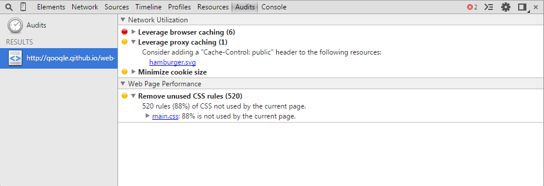
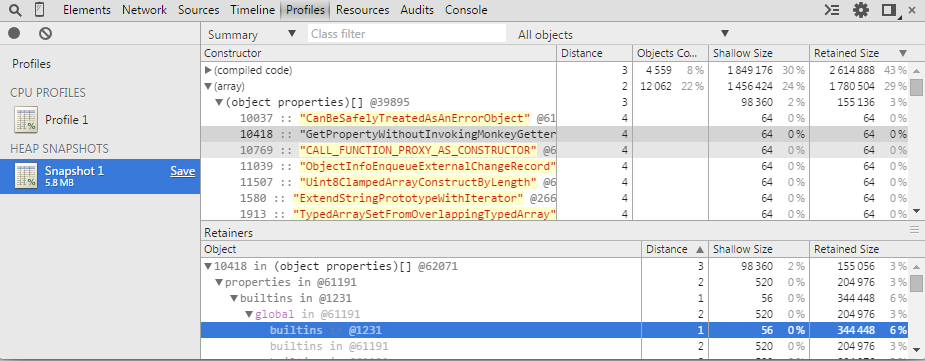

## Chrome DevTools Overview

> 谷歌开发者工具(简称DevTools)是一套用于web编程和调试工具，集成到Google Chrome
浏览器。开发工具提供给web开发者深入浏览器的内部架构和他们自己的web应用程序。
用它能让开发人员高效地跟踪布局问题，设置JavaScript断点，和了解代码优化

#### Accessing the DevTools
为了能使用`DevTools`,用chrome打开一个网页或者webapp，选择下面一种做法即可
* 在你的浏览器窗口的右上角选中**chrome menu** ，然后选中**工具** > __开发者工具__。
* 在页面的任何元素右键显示菜单并选中**审查元素**
* __F12__ `(译者注：我自己添加上去的)`

这个时候DevTools窗口在你的Chrome浏览器的底部打开。

下面有一些有用打开DevTools的快捷键
* `Ctrl+Shift+I`(或者`Cmd+Opt+I` Mac) 打开DevTools
* `Ctrl+Shift+J`(或者`Cmd+Opt+J` Mac) 打开DevTools并显示 **Console**面板
* `Ctrl+Shift+C`(或者`Cmd+Opt+C` Mac) 打开DevTools的审查元素模式或者触发审查元素当DevTools已经打开

对于你每天的工作，[learning the shortcuts](https://developer.chrome.com/devtools/docs/shortcuts)可以帮你节约时间。

#### The DevTools window

`DevTools是由位于窗口顶部的任务栏里的多任务导向型分组构成的`，每一个工具栏项和它对应的面板都可以让你了解到某种特定类型的页面或者应用程序的相关信息，包括**DOM elements**，__resources__和**sources**

总共有八个主要工具组可用来查看开发者工具
* **Elements**
* **Resources**
* **Network**
* **Sources**
* **Timeline**
* **Profiles**
* **Audits**
* **Console**

可以用 `ctrl+[`和`ctrl+]`快捷键在这些面板之间切换

#### Inspecting the DOM and styles
__Elements__面板可以让你查看到一棵 DOM树的任何信息，并且允许你审查和实时编辑DOM元素。你会经常用到__Elements__标签当你需要为页面的某些情况去识别它的HTML代码块的时候。比如，你可能好奇说__image__是不是有id属性并且他的值是啥？

在DOM树里查看标题标签

[Read more about inspecting the DOM and styles](https://developer.chrome.com/devtools/docs/dom-and-styles)

#### Working with the Console

__Console__面板为开发者测试web页面和应用程序提供了两个原生方法。

* 在开发过程中打印出调试信息
* __shell prompt__ 可以用来跟文档和**DevTools**进行交互

你可以用__Console API__提供的方法去打印调试信息，比如__console.log()__或者__console.profile()__

你可以直接在__Console__上测试下JavaScript一些表达式，还可以用一些 __Command Line API__提供的方法。这些包括用__$()__命令去选中元素或者用__prfile()__去创建 CPU 分析器

在JS控制台上执行一些命令

[Read more about working with the console](https://developer.chrome.com/devtools/docs/console)
#### Debugging JavaScript

随着JavaScript应用程序的复杂度日益增加，开发者需要一些强有力的调试工具去帮助他们快速定位到问题和高效修复问题。**Chrome DevTools**包括了一些有用的工具去帮助减少开发者调试JavaScript的痛苦。

设置了条件断点

[Read more about how to debug JavaScript with the DevTools »](https://developer.chrome.com/devtools/docs/javascript-debugging)

#### Improving network performance

__Network__ 面板提供可以让你深入了解资源在被请求和下载时候网络的实时变化。识别和处理这些花费比预计时间还长的请求是在优化你的页面的必要的一步。

这个上下文菜单就是有关网络请求

[Read more about how to improve your network performance »](https://developer.chrome.com/devtools/docs/network)
#### Audits

**Audits** 面板能让你分析正在下载的页面。然后会为减少页面加载时间和提高感知(和实时)响应能力。如果想进一步了解，我们推荐使用[PageSpeed Insights](https://developers.google.com/speed/pagespeed/insights/)

某个审计提出的一些优化建议点

#### Improving rendering performance

**Timeline**面板给你一个时间花费的全面概览，当你正在加载和使用你的web应用程序或者是页面的时候。所有的事件，从加载资源到解析JavaScript，计算样式和重绘都会显示到这个时间轴上。

一个有不同事件的示例时间轴

[Read more about how to improve rendering performance »](https://developer.chrome.com/devtools/docs/timeline)
#### JavaScript & CSS performance

**Profiles**面板可以让你描述web应用程序或者页面的执行时间和内存的使用。这些都帮你去理解那些资源是被使用到的，因此能帮你去优化你的代码。这些提供的分析工具有：
* **CPU profiler**显示了在你页面的JavaScript函数中执行时间花费在哪里
* __Heap profiler__ 显示有关你有关页面的JavaScript对象和相关DOM节点的内存分配。
* __JavaScript profiler__显示了在你的脚本代码中执行时间花费的情况

__Heap profiler__是示例

[Read more about using how to improve JavaScript and CSS performance »](https://developer.chrome.com/devtools/docs/profiles)
#### Inspecting storage
**Resources** 面板让你可以审查到被下载的的资源。它让你可以跟HTML5 DataBase，LocalStorage，Cookies，AppCache等等交互。

**Web Starter Kit**的js文件被展示到**Resources** 面板

[Read more about inspecting storage resources »](https://developer.chrome.com/devtools/docs/resource-panel)

#### Further reading

这有一些其他的DevTools 文档你可能会找到一些有用的。包括
* [Heap Profiling](https://developer.chrome.com/devtools/docs/heap-profiling)
* [CPU Profiling](https://developer.chrome.com/devtools/docs/cpu-profiling)
* [Device Mode & Mobile Emulation](https://developer.chrome.com/devtools/docs/device-mode)
* [Remote Debugging](https://developer.chrome.com/devtools/docs/remote-debugging)
* [DevTools Videos](https://developer.chrome.com/devtools/docs/videos)

#### Further resources
__略__
